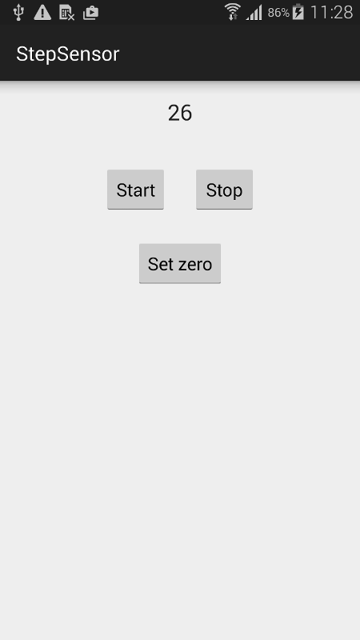

# StepSensor [](https://android-arsenal.com/details/1/1524)
A library containing a custom Service allowing to collect data from the Sensor.TYPE_STEP_COUNTER introduced with Android 4.4 (available only for devices that supports this hardware feature)

A SwipeRefreshLayout extension that allows to swipe in both direction (API 9+)

To include in your project, add this to your build.gradle file:
```
   //StepSensor
   compile 'com.github.orangegangsters:sensorstep:1.4.1@aar'
```



========

### Usage

If you want an example on how to use it, you can find an example app in this repo.

You need to extends four classes and implements their methods (see the example app):
```
BootCompletedReceiver
SensorStepReceiver
SensorStepService
SensorStepServiceManager
```

This allows you to choose your own storage solution (database, SharedPreferences ...).

========

### Credits

### By Developers:
[Olivier Goutay](https://github.com/olivierg13) and [Stoyan Dimitrov](https://github.com/StoyanD)

========

### License

```
The MIT License (MIT)

Copyright (c) 2015 OrangeGangsters

Permission is hereby granted, free of charge, to any person obtaining a copy
of this software and associated documentation files (the "Software"), to deal
in the Software without restriction, including without limitation the rights
to use, copy, modify, merge, publish, distribute, sublicense, and/or sell
copies of the Software, and to permit persons to whom the Software is
furnished to do so, subject to the following conditions:

The above copyright notice and this permission notice shall be included in all
copies or substantial portions of the Software.

THE SOFTWARE IS PROVIDED "AS IS", WITHOUT WARRANTY OF ANY KIND, EXPRESS OR
IMPLIED, INCLUDING BUT NOT LIMITED TO THE WARRANTIES OF MERCHANTABILITY,
FITNESS FOR A PARTICULAR PURPOSE AND NONINFRINGEMENT. IN NO EVENT SHALL THE
AUTHORS OR COPYRIGHT HOLDERS BE LIABLE FOR ANY CLAIM, DAMAGES OR OTHER
LIABILITY, WHETHER IN AN ACTION OF CONTRACT, TORT OR OTHERWISE, ARISING FROM,
OUT OF OR IN CONNECTION WITH THE SOFTWARE OR THE USE OR OTHER DEALINGS IN THE
SOFTWARE.
```
